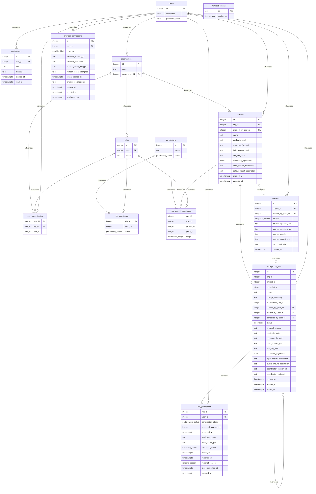

# Database diagram

Generated from the current schema. Snapshot file contents are Git commits in private
project repositories; the database stores their commit IDs and ownership metadata.

```mermaid
erDiagram
    users {
        integer id PK
        text username
        text password_hash
    }
    revoked_tokens {
        text jti PK
        timestamptz expires_at
    }
    notifications {
        integer id PK
        integer user_id FK
        text title
        text message
        timestamptz created_at
        timestamptz read_at
    }
    organizations {
        integer id PK
        text name
        integer owner_user_id FK
    }
    roles {
        integer id PK
        integer org_id FK
        text name
    }
    user_organization {
        integer user_id FK
        integer org_id FK
        integer role_id
    }
    permissions {
        integer id PK
        text name
        permission_scope scope
    }
    role_permission {
        integer role_id FK
        integer perm_id
        permission_scope scope
    }
    provider_connections {
        integer id PK
        integer user_id FK
        provider_kind provider
        text external_account_id
        text external_username
        text access_token_encrypted
        text refresh_token_encrypted
        timestamptz token_expires_at
        text granted_permissions
        timestamptz created_at
        timestamptz updated_at
        timestamptz invalidated_at
    }
    projects {
        integer id PK
        integer org_id FK
        integer created_by_user_id FK
        text name
        text dockerfile_path
        text compose_file_path
        text build_context_path
        text env_file_path
        jsonb command_arguments
        text input_mount_destination
        text output_mount_destination
        timestamptz created_at
        timestamptz updated_at
    }
    role_project_permission {
        integer org_id
        integer role_id
        integer project_id
        integer perm_id
        permission_scope scope
    }
    snapshots {
        integer id PK
        integer project_id FK
        integer created_by_user_id FK
        snapshot_source source
        text source_repository_id
        text source_repository_url
        text source_branch
        text source_commit_sha
        text git_commit_sha
        timestamptz created_at
    }
    deployment_runs {
        integer id PK
        integer org_id
        integer project_id
        integer snapshot_id
        text name
        text change_summary
        integer supersedes_run_id
        integer created_by_user_id FK
        integer started_by_user_id FK
        integer cancelled_by_user_id FK
        run_status status
        text terminal_reason
        text dockerfile_path
        text compose_file_path
        text build_context_path
        text env_file_path
        jsonb command_arguments
        text input_mount_destination
        text output_mount_destination
        text coordinator_session_id
        text coordinator_endpoint
        timestamptz created_at
        timestamptz started_at
        timestamptz ended_at
    }
    run_participants {
        integer run_id FK
        integer user_id FK
        participation_status participation_status
        integer accepted_snapshot_id
        timestamptz accepted_at
        text local_input_path
        text local_output_path
        execution_status execution_status
        timestamptz joined_at
        timestamptz removed_at
        removal_reason removal_reason
        timestamptz stop_requested_at
        timestamptz stopped_at
    }
    deployment_runs ||--o{ deployment_runs : references
    deployment_runs ||--o{ run_participants : references
    organizations ||--o{ projects : references
    organizations ||--o{ roles : references
    organizations ||--o{ user_organization : references
    permissions ||--o{ role_permission : references
    permissions ||--o{ role_project_permission : references
    projects ||--o{ deployment_runs : references
    projects ||--o{ role_project_permission : references
    projects ||--o{ snapshots : references
    roles ||--o{ role_permission : references
    roles ||--o{ role_project_permission : references
    roles ||--o{ user_organization : references
    snapshots ||--o{ deployment_runs : references
    users ||--o{ deployment_runs : references
    users ||--o{ notifications : references
    users ||--o{ organizations : references
    users ||--o{ projects : references
    users ||--o{ provider_connections : references
    users ||--o{ run_participants : references
    users ||--o{ snapshots : references
    users ||--o{ user_organization : references
```
